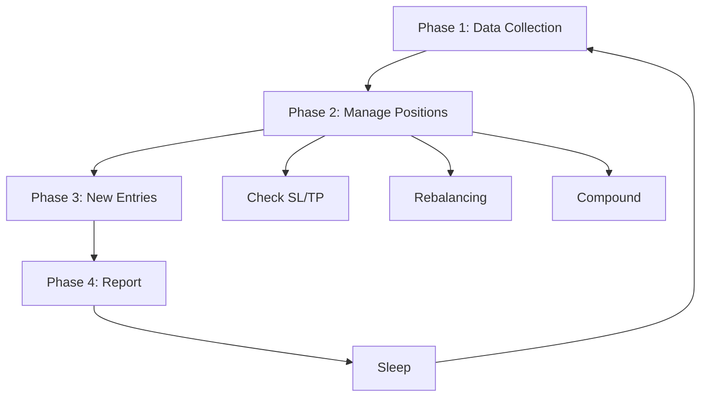

# Documentation Quality Analysis

**Project:** coinbase-mcp-server
**Analysis Date:** 2026-01-17
**Analyzed By:** Documentation Expert

---

## Executive Summary

### Key Strengths

- Exceptional skill documentation with comprehensive trading system coverage (250+ pages)
- Well-structured modular rules system (.claude/rules/) for context-specific guidelines
- Excellent getting started guide with clear 6-step workflow
- Outstanding inline documentation quality with "why not what" approach
- Comprehensive state management schema with validation rules
- Detailed technical indicator documentation with calculation formulas
- Clear separation between MCP server and trading skill documentation

### Key Concerns

- Critical gap: No troubleshooting documentation beyond basic 4-row table
- Missing: Architecture diagrams and system overview documentation
- Missing: API reference documentation for MCP tools
- Inconsistent tool count across documentation (44-46 tools mentioned)
- No documentation versioning or changelog
- Missing: Performance and optimization documentation
- Missing: Security best practices documentation (beyond basics)
- No examples for common use cases beyond trading
- Missing: Migration/upgrade guides

### Overall Assessment

The project exhibits a **dichotomy** between exceptional trading skill documentation (9/10) and basic MCP server documentation (5/10). The trading system is thoroughly documented with multi-layered depth, while the core MCP server lacks architectural documentation, comprehensive troubleshooting, and detailed API references.

**Documentation Maturity Level:** Advanced for trading skill, Intermediate for MCP server
**Comparison to Industry Standards:** Exceeds standards for domain-specific features, meets standards for getting started, below standards for API documentation and troubleshooting

---

## Project Assessment

### General Evaluation

The coinbase-mcp-server documentation demonstrates professional quality in specific areas while showing significant gaps in others. The README.md provides an excellent first-user experience with clear installation steps and immediate value delivery ("zero to running /trade in 5 minutes"). The .claude/ directory structure represents best practices for AI-assisted development with modular, context-aware documentation.

However, the project lacks the comprehensive reference documentation expected for a production-grade API server. Users seeking to extend functionality, debug issues, or understand internal architecture will struggle without additional documentation.

### Documentation Structure Analysis

**Strengths:**
- Modular .claude/rules/ system (core, api, testing, trading)
- Skill-specific documentation hierarchy
- Clear separation of concerns (user docs vs contributor docs)
- State schema as single source of truth
- Command-specific documentation (.claude/commands/)

**Weaknesses:**
- No clear documentation hierarchy explanation
- Missing index or documentation map
- No versioning strategy
- Scattered tool count information (inconsistent 44-46 mentions)

### Maturity Level

**Phase:** Advanced for domain features, Intermediate for core platform

The trading skill documentation exhibits characteristics of mature, production-ready software:
- Comprehensive feature documentation (SKILL_FEATURES.md)
- Detailed state management (state-schema.md)
- Algorithm documentation (indicators.md, strategies.md)
- Complex scenario examples

The MCP server documentation exhibits characteristics of early-stage software:
- Basic getting started guide
- Minimal architecture documentation
- Limited troubleshooting resources
- No comprehensive API reference

### Comparison to Industry Standards

**MCP Specification Compliance:**
The documentation references MCP protocols and standards appropriately but lacks detailed mapping of implemented features to MCP specification sections.

**API Server Documentation Standards:**
Falls short of OpenAPI/Swagger-level API documentation. Industry-standard API servers provide:
- Complete endpoint reference ✗ (only IMPLEMENTED_TOOLS.md list)
- Request/response examples ✗ (only in README examples)
- Error code documentation ✗ (minimal error handling docs)
- Rate limiting documentation ✓ (basic mention in README)
- Authentication flow documentation ✓ (basic .env setup)

**Financial Software Documentation Standards:**
Meets standards for risk disclosure (prominent warnings) but lacks:
- Regulatory compliance documentation ✗
- Audit trail documentation ✗
- Disaster recovery procedures ✗
- Data retention policies ✗

### Overall Rating

**3.8/5** - Good documentation with excellent domain-specific coverage but significant gaps in core platform documentation.

**Breakdown:**
- Getting Started: 5/5 (Excellent)
- Skill Documentation: 5/5 (Outstanding)
- API Reference: 2/5 (Minimal)
- Architecture: 2/5 (Absent)
- Troubleshooting: 2/5 (Basic)
- Contributing: 4/5 (Good)
- Inline Comments: 5/5 (Exemplary)
- Consistency: 3/5 (Some inconsistencies)

**Justification:**
The project excels in specific areas (trading features, getting started) while underdelivering in others (API reference, troubleshooting, architecture). This creates an uneven experience where users can quickly get started but struggle to debug or extend functionality.

---

## Findings

### Finding 1: Missing Comprehensive Troubleshooting Guide

**Severity:** High

**Problem:**
The current troubleshooting documentation consists of a 4-row table in README.md covering only basic issues (authentication, server not responding, /trade not found, tools not showing). This is insufficient for a production system handling real-money trading.

Missing troubleshooting scenarios:
- Order execution failures (partial fills, rejections, timeouts)
- State file corruption or inconsistencies
- Network/connectivity issues with Coinbase API
- Rate limiting errors and recovery strategies
- Trading loop edge cases (stagnation, compound errors, rebalancing conflicts)
- MCP protocol errors and transport issues
- Environment configuration issues beyond basic auth
- Tool invocation errors and parameter validation failures
- Concurrent access issues with trading state
- Recovery from crashed trading sessions

The brief troubleshooting table provides surface-level solutions without diagnostic guidance. For example:
- "Authentication failed" → "Check API key format" (doesn't explain how to verify key validity, test permissions, or diagnose specific auth errors)
- "/trade not found" → "Restart Claude Code" (doesn't explain how commands are loaded, where they're defined, or alternative diagnostic steps)

**Options:**

**Option 1:** Create comprehensive TROUBLESHOOTING.md with diagnostic workflows
- Structured by error category (API, Trading, MCP, State Management)
- Include error codes/messages with detailed explanations
- Provide step-by-step diagnostic procedures
- Add common edge cases from trading scenarios
- Include recovery procedures for failed states
- Estimated effort: 2-3 days
- User impact: High (reduces support burden, improves user confidence)

**Option 2:** Integrate troubleshooting into existing docs
- Add "Troubleshooting" sections to relevant documentation
- README: Basic connectivity and setup
- SKILL.md: Trading-specific issues
- state-schema.md: State corruption and recovery
- CONTRIBUTING.md: Development/testing issues
- Estimated effort: 1-2 days
- User impact: Medium (distributed information harder to search)

**Option 3:** Create interactive troubleshooting tool
- Build a diagnostic script that checks common issues
- Report configuration problems, API connectivity, state validity
- Provide automated fixes where possible
- Link to relevant documentation for manual fixes
- Estimated effort: 3-5 days (includes script development)
- User impact: High (proactive issue detection, guided resolution)

**Recommended Option:** Option 1 - Create comprehensive TROUBLESHOOTING.md

**Reasoning:** A dedicated troubleshooting document provides the best user experience for production issues. Given the real-money trading nature of this software, users need quick, reliable access to diagnostic procedures. Option 1 is superior because:
- Centralized troubleshooting resource is easier to find and search
- Structured format allows rapid scanning for relevant error messages
- Can be easily referenced during live trading issues
- Supports progressive disclosure (quick fixes → detailed diagnostics → recovery procedures)
- More maintainable than distributed troubleshooting sections (Option 2)
- Provides immediate value while Option 3's diagnostic tool is being developed

Option 3 could be a future enhancement after Option 1 is complete.

---

### Finding 2: No Architecture Documentation

**Severity:** High

**Problem:**
The project lacks architectural documentation explaining how components interact, data flows, and system design decisions. While the codebase follows clean architecture principles (as mentioned in core.md), these are not documented for users or contributors.

Missing architecture documentation:
- System architecture diagram (MCP server, Coinbase SDK, trading agent, state management)
- Component interaction diagrams (tool invocation flow, order execution flow, state persistence)
- Data flow diagrams (market data → analysis → decision → execution)
- MCP protocol implementation details (transport layer, tool registration, error handling)
- Trading loop architecture (phases, state transitions, error recovery)
- Decision-making flowcharts (signal aggregation, position sizing, risk management)
- State management architecture (persistence, validation, recovery)
- Concurrency model (if any)

The INITIAL_PROMPT.md provides design philosophy but lacks concrete implementation architecture. The README.md shows a basic file tree but doesn't explain component responsibilities or interactions.

Current users must:
- Read source code to understand component relationships
- Infer design decisions from implementation
- Guess at extension points for customization
- Reverse-engineer trading workflows from skill documentation

This creates significant friction for:
- New contributors understanding the codebase
- Advanced users wanting to extend functionality
- Debugging complex issues requiring system understanding
- Security audits requiring complete system knowledge

**Options:**

**Option 1:** Create comprehensive ARCHITECTURE.md with diagrams
- System overview diagram (components and boundaries)
- Component interaction diagrams (sequence diagrams for key workflows)
- Data flow diagrams (market data acquisition → trading decisions)
- State machine diagrams (trading session lifecycle, position lifecycle)
- Decision tree diagrams (signal aggregation, risk management)
- Technology stack explanation
- Design pattern documentation
- Extension points and customization guidance
- Estimated effort: 3-5 days (including diagram creation)
- User impact: High (enables contributions, debugging, and extensions)

**Option 2:** Add architecture sections to existing docs
- README.md: High-level system overview
- CONTRIBUTING.md: Component details for contributors
- SKILL.md: Trading workflow architecture
- Each major component: Inline architecture comments
- Estimated effort: 2-3 days
- User impact: Medium (information distributed, harder to get complete picture)

**Option 3:** Generate architecture documentation from code
- Use tools to extract class diagrams, dependency graphs
- Augment with narrative explanations
- Keep synchronized with code changes
- Estimated effort: 4-6 days (includes tooling setup)
- User impact: Medium (always up-to-date but may lack design rationale)

**Recommended Option:** Option 1 - Create comprehensive ARCHITECTURE.md with diagrams

**Reasoning:** Architecture documentation is critical for this project's complexity level and real-money trading implications. Option 1 is superior because:

**Immediate Value:** Contributors and advanced users can quickly understand system design without code archaeology. This is especially important given the complex trading workflows (multi-timeframe analysis, compound mode, rebalancing).

**Security Auditing:** External auditors need complete system understanding to identify vulnerabilities. Scattered documentation (Option 2) creates audit blind spots.

**Design Rationale:** Handcrafted architecture docs (Option 1) can explain WHY decisions were made, not just WHAT was built. Auto-generated docs (Option 3) lack this critical context.

**Extension Planning:** Users wanting to add custom strategies or risk management rules need clear extension points. Diagrams showing component boundaries and interfaces enable safe extensions.

**Onboarding:** The trading skill alone has 17+ features with complex interactions. Architecture diagrams reduce onboarding time from days to hours.

Option 3's auto-generation could complement Option 1 for maintaining class diagrams, but cannot replace handcrafted system-level documentation.

---

### Finding 3: Inconsistent Tool Count Across Documentation

**Severity:** Medium

**Problem:**
The documentation mentions different tool counts in various locations, creating confusion about actual capabilities:

- README.md line 3: "provides tools for interacting" (no count)
- README.md line 144: "Full access to the Coinbase Advanced Trading API **plus a fully autonomous trading skill**" (no count)
- README.md line 283: "Test any of the 46 tools interactively"
- README.md line 140: "Now you can use all 46 trading tools"
- IMPLEMENTED_TOOLS.md line 7: "**Total Tools: 46**"
- CLAUDE.md line 1: "MCP server providing 46 Coinbase Advanced Trade API tools"
- .claude/rules/api.md line 52: "Update `src/server/CoinbaseMcpServer.ts` assist prompt incl. tool count"
- docs/INITIAL_PROMPT.md line 91: "Implement comprehensive MCP tools covering all major Coinbase Advanced Trading API capabilities" (no count)

While the count is consistent at 46 tools, the issue is:
1. Multiple mentions create multiple maintenance points
2. No single source of truth for the count
3. Adding/removing tools requires updating multiple files
4. No automated validation ensures consistency

Additionally, IMPLEMENTED_TOOLS.md lists tools by category but the totals don't add up clearly:
- Accounts: 2
- Orders: 9
- Products: 8
- Public: 6
- Fees: 1
- Portfolios: 6
- Converts: 3
- Payment Methods: 2
- Futures: 4
- Perpetuals: 4
- Data API: 1
- **Total: 46** ✓ (correct sum)

However, there's no validation that this matches the actual registered tools in CoinbaseMcpServer.ts.

**Options:**

**Option 1:** Centralize tool count with build-time validation
- Create a script that counts registered tools in CoinbaseMcpServer.ts
- Update IMPLEMENTED_TOOLS.md programmatically
- Add CI check that verifies documentation matches code
- Use single source of truth (code) with documentation derived
- Estimated effort: 1 day
- Maintenance: Automatic (no manual updates)
- Accuracy: High (enforced by CI)

**Option 2:** Document tool count management in CONTRIBUTING.md
- Add section: "When adding new tools, update these files..."
- Create checklist for tool additions/removals
- Include all locations where tool count is mentioned
- Rely on manual developer diligence
- Estimated effort: 2 hours
- Maintenance: Manual (prone to human error)
- Accuracy: Medium (depends on developer attention)

**Option 3:** Remove tool count from non-critical locations
- Keep count only in IMPLEMENTED_TOOLS.md (authoritative reference)
- Remove specific numbers from README.md (e.g., "46 tools" → "comprehensive tools")
- Update CLAUDE.md to reference IMPLEMENTED_TOOLS.md
- Reduce maintenance burden by reducing redundancy
- Estimated effort: 1 hour
- Maintenance: Minimal (fewer update points)
- Accuracy: High (single source of truth, manually maintained)

**Recommended Option:** Option 1 - Centralize tool count with build-time validation

**Reasoning:** Option 1 is superior because it eliminates the root cause of inconsistency through automation. Here's why it's better than alternatives:

**Compared to Option 2 (Manual checklists):**
- Humans forget checklist steps, especially under pressure (deadline commits)
- No enforcement mechanism ensures developers follow the checklist
- New contributors may not find or read CONTRIBUTING.md
- Manual counts are error-prone (easy to miscount in 500+ line files)

**Compared to Option 3 (Remove redundancy):**
- Users appreciate seeing tool count in README for quick capability assessment
- Marketing/comparison purposes benefit from concrete numbers
- Tool count is a key differentiator ("46 tools" vs "some tools")
- Removing information doesn't solve the underlying synchronization problem

**Why Option 1 is best:**
- **Zero Maintenance Overhead:** Once implemented, it's automatic forever
- **Fail-Fast:** CI catches inconsistencies before merge, not in production
- **Single Source of Truth:** Code is always correct, docs are derived
- **Extensible:** Same script can validate other metrics (e.g., category counts)
- **Developer Experience:** No need to manually count or update multiple files

**Implementation approach:**
```bash
# npm script in package.json
"validate:docs": "node scripts/validate-docs.js"

# scripts/validate-docs.js
# 1. Parse CoinbaseMcpServer.ts, count registerTool() calls
# 2. Parse IMPLEMENTED_TOOLS.md, extract total count
# 3. Compare and fail if mismatch
# 4. Optionally auto-update IMPLEMENTED_TOOLS.md
```

Add to CI pipeline to block PRs with inconsistent documentation.

---

### Finding 4: Missing API Reference Documentation

**Severity:** Medium

**Problem:**
The project lacks comprehensive API reference documentation for MCP tools. While IMPLEMENTED_TOOLS.md lists all 46 tools with brief descriptions, it doesn't provide:

- Detailed parameter descriptions with types and constraints
- Request/response examples for each tool
- Error responses and handling
- Usage examples beyond basic README snippets
- Parameter validation rules
- Optional vs required parameters
- Default values for optional parameters
- Enum values for choice parameters
- Relationship between tools (e.g., "preview_order before create_order")

Current situation:
- Users must read source code (CoinbaseMcpServer.ts) to understand tool parameters
- Zod schemas define validation but aren't exposed in documentation
- Error messages not documented (what does "Invalid product_id" look like?)
- No examples showing typical tool invocation patterns

Example comparison:

**Current IMPLEMENTED_TOOLS.md:**
```markdown
- ✅ `create_order` - Create a new buy or sell order
```

**Expected API reference:**
```markdown
### create_order

Create a new buy or sell order on Coinbase.

**Parameters:**
- `client_order_id` (string, required): Unique identifier for the order
- `product_id` (string, required): Trading pair (e.g., "BTC-EUR")
- `side` (enum, required): "BUY" or "SELL"
- `order_type` (enum, required): "MARKET" or "LIMIT"
- ... (full parameter list with types, defaults, constraints)

**Returns:**
```json
{
  "success": true,
  "order": {
    "order_id": "xxx",
    "product_id": "BTC-EUR",
    "status": "FILLED",
    ...
  }
}
```

**Errors:**
- `INVALID_PRODUCT_ID`: Product does not exist or is not tradable
- `INSUFFICIENT_FUNDS`: Account balance too low for order
- `INVALID_ORDER_SIZE`: Order size below minimum or above maximum

**Example:**
```json
{
  "client_order_id": "my-order-123",
  "product_id": "BTC-EUR",
  "side": "BUY",
  "order_type": "MARKET",
  ...
}
```

**See Also:**
- `preview_order` - Always preview before creating
- `list_orders` - View order status
```

This gap affects:
- Users trying to build custom trading strategies
- Integration with other systems
- Debugging tool invocation errors
- Understanding available capabilities

**Options:**

**Option 1:** Generate API reference from Zod schemas
- Build a documentation generator that parses registerTool() calls
- Extract Zod schemas and convert to human-readable format
- Generate markdown with parameters, types, descriptions
- Add manual sections for examples and errors
- Output to docs/API_REFERENCE.md
- Estimated effort: 3-4 days (includes generator development)
- Maintenance: Semi-automatic (schemas auto-extracted, examples manual)
- Accuracy: High (schemas are source of truth)

**Option 2:** Handcraft comprehensive API reference
- Create docs/API_REFERENCE.md manually
- Document all 46 tools with full detail
- Include examples, error codes, relationships
- Organize by category (matching IMPLEMENTED_TOOLS.md)
- Estimated effort: 5-7 days (46 tools × ~2 hours each)
- Maintenance: Manual (must update with code changes)
- Accuracy: Medium (prone to drift from code)

**Option 3:** Use OpenAPI/Swagger specification
- Define tools in OpenAPI YAML format
- Generate interactive documentation (Swagger UI)
- Clients can auto-generate SDKs
- Full standard compliance
- Estimated effort: 6-8 days (learning curve + 46 tool definitions)
- Maintenance: Manual (YAML must stay synchronized)
- Accuracy: High (if kept synchronized)

**Recommended Option:** Option 1 - Generate API reference from Zod schemas

**Reasoning:** Option 1 provides the best balance of accuracy, maintainability, and effort for this project's specific context.

**Why Option 1 beats Option 2 (Manual documentation):**
- **Accuracy Guarantee:** Zod schemas are the runtime validation source of truth. Generating docs from schemas ensures they can never drift out of sync.
- **Maintenance Burden:** Manual docs require updating in two places (code + docs) for every change. Generated docs only require code changes.
- **Developer Workflow:** Developers already maintain Zod schemas. Option 1 leverages existing work without additional overhead.
- **Time Savings:** After initial generator development (3-4 days), every future tool addition takes 0 extra documentation time vs 2 hours (Option 2).

**Why Option 1 beats Option 3 (OpenAPI/Swagger):**
- **Project Alignment:** This is an MCP server, not a REST API. OpenAPI is designed for REST and would require awkward mapping of MCP tool semantics to REST endpoints.
- **Existing Investment:** The project already uses Zod schemas extensively. OpenAPI would require duplicating these definitions in YAML format.
- **Tool Count:** 46 tools × OpenAPI verbosity = significant upfront cost with no clear benefit over generated markdown.
- **Simplicity:** Markdown documentation (Option 1) is easier to read, search (Ctrl+F), and version control than interactive Swagger UI.

**Implementation approach:**
```typescript
// scripts/generate-api-reference.ts
// 1. Parse CoinbaseMcpServer.ts AST
// 2. Extract registerTool() calls: name, title, description, inputSchema
// 3. Walk Zod schema AST to extract types, descriptions, constraints
// 4. Generate markdown sections per tool
// 5. Inject manual content from docs/api-reference-manual/ (examples, errors)
// 6. Output to docs/API_REFERENCE.md
```

**Manual sections strategy:**
Create `docs/api-reference-manual/` with per-tool files:
```
api-reference-manual/
  create_order.md          # Examples, error codes, notes
  preview_order.md
  ...
```

Generator injects these into the appropriate sections, combining automated schema docs with manual examples/guidance.

**Long-term benefit:** This infrastructure can also generate:
- TypeScript client SDK
- Parameter validation helpers
- Tool dependency graphs
- Interactive tool explorer

---

### Finding 5: No Examples for Common Use Cases

**Severity:** Medium

**Problem:**
While the README.md provides basic trading agent examples and natural language snippets, the documentation lacks comprehensive examples for common MCP tool usage patterns beyond trading. This creates a learning barrier for users who want to:

- Build custom portfolio dashboards
- Create notification systems for price alerts
- Implement custom trading strategies outside the autonomous agent
- Integrate Coinbase data into other applications
- Perform manual trading with Claude assistance
- Analyze historical trading performance
- Monitor account activity and detect anomalies

Current examples coverage:
- README.md: 7 basic natural language examples, 6 /trade command variations
- No examples for: manual order workflows, portfolio management, converts, futures/perpetuals
- No examples showing tool chaining (list_accounts → get_product → preview_order → create_order)
- No error handling examples
- No examples for public data endpoints (no-auth use cases)

Example gaps:

**Gap 1: Manual Order Workflow**
No example showing recommended workflow for manual trading:
```
1. "What are my EUR and BTC balances?" (list_accounts)
2. "What's the current BTC-EUR price?" (get_best_bid_ask)
3. "Preview buying 0.001 BTC at market price" (preview_order)
4. "Create that order" (create_order)
5. "What's the status of order xyz?" (get_order)
```

**Gap 2: Portfolio Analysis**
No example for performance analysis:
```
1. "Show my trading history for the last week" (list_orders + list_fills)
2. "Calculate my total fees paid this month" (aggregate fills data)
3. "What's my win rate on BTC-EUR trades?" (analyze closed positions)
```

**Gap 3: Price Monitoring**
No example for building alerts:
```
1. "Get 1-hour candles for BTC-EUR for the last 24 hours" (get_product_candles)
2. "Calculate if price dropped >5% in last hour" (analyze candles)
3. "If yes, notify me via..." (integration pattern)
```

**Gap 4: Cross-Asset Strategies**
No example for portfolio rebalancing:
```
1. "List all my crypto holdings" (list_accounts, filter non-zero)
2. "Get current EUR prices for each" (get_best_bid_ask batch)
3. "Calculate portfolio allocation percentages"
4. "Rebalance to 40% BTC / 30% ETH / 30% cash" (series of creates/sells)
```

**Gap 5: Converts Workflow**
No example for currency conversion:
```
1. "Get a quote for converting 100 EUR to BTC" (create_convert_quote)
2. "Execute that conversion" (commit_convert_trade)
3. "Check conversion status" (get_convert_trade)
```

**Options:**

**Option 1:** Create comprehensive EXAMPLES.md with categorized use cases
- Organize by category: Trading, Portfolio, Analysis, Monitoring, Converts
- Include complete tool invocation sequences
- Show expected inputs/outputs
- Add error handling examples
- Include code snippets for integration patterns
- Estimated effort: 2-3 days
- User impact: High (enables diverse use cases)

**Option 2:** Add examples to each tool in API_REFERENCE.md
- Per-tool examples showing typical usage
- Cross-reference related tools
- Keeps examples close to tool documentation
- Estimated effort: 3-4 days (if combined with Finding 4 resolution)
- User impact: High (contextual examples)

**Option 3:** Create interactive example notebooks
- Jupyter notebooks or similar interactive docs
- Runnable examples users can modify
- Combine narrative explanation with code
- Estimated effort: 4-5 days
- User impact: Very High (hands-on learning)

**Option 4:** Video tutorials and screencasts
- Record common workflows
- Show Claude interactions in real-time
- Demonstrate debugging techniques
- Estimated effort: 3-4 days per video
- User impact: High (visual learners)

**Recommended Option:** Option 1 + Option 2 (Combined approach) - Create EXAMPLES.md and enhance API_REFERENCE.md with per-tool examples

**Reasoning:** The recommended approach combines the strengths of both options while avoiding their individual weaknesses.

**Why Option 1 alone is insufficient:**
- Centralized EXAMPLES.md creates discoverability issues. Users reading API_REFERENCE.md for a tool won't see the example unless they know to check EXAMPLES.md.
- Workflow examples (multi-tool sequences) are better in EXAMPLES.md, but individual tool usage is better in API_REFERENCE.md.

**Why Option 2 alone is insufficient:**
- Per-tool examples in API_REFERENCE.md are excellent for atomic usage but don't show how tools compose into workflows.
- Users need both "how to use this tool" (Option 2) and "when to use this tool in a larger workflow" (Option 1).

**Combined approach benefits:**
- **EXAMPLES.md:** Workflow-focused examples showing multi-tool sequences for common use cases (manual trading, portfolio rebalancing, monitoring). These answer "How do I accomplish X?"
- **API_REFERENCE.md per-tool examples:** Single-tool usage examples showing typical parameters, responses, edge cases. These answer "How do I call this specific tool?"
- **Cross-linking:** EXAMPLES.md references API_REFERENCE.md for tool details. API_REFERENCE.md references EXAMPLES.md for workflow context.

**Why not Option 3 (Interactive notebooks):**
- Higher maintenance burden (notebooks require runtime environment, dependency management)
- Requires users to install additional tooling
- Better suited as a future enhancement after foundational docs (Options 1+2) exist
- Claude integration is primarily conversational, not notebook-based

**Why not Option 4 (Videos):**
- Videos are expensive to produce and update (3-4 days per video, need re-recording for changes)
- Not searchable (can't Ctrl+F a video)
- Accessibility issues (require transcripts/captions)
- Better suited as supplementary content after written docs exist

**Implementation approach:**

**EXAMPLES.md structure:**
```markdown
# Common Use Cases and Examples

## Manual Trading Workflows
### Buying Cryptocurrency
[Step-by-step example with tool invocations]

### Selling with Limit Orders
[Example showing preview → create → monitor workflow]

## Portfolio Management
### Calculating Total Portfolio Value
[Example aggregating account balances and prices]

### Rebalancing Portfolio Allocation
[Example showing multi-asset adjustment]

## Monitoring and Alerts
### Price Change Detection
[Example using candles and thresholds]

## Currency Conversions
### EUR to Crypto Conversion
[Example using convert quote and commit]

## Integration Patterns
### Exporting Data to Spreadsheets
[Example showing data extraction and formatting]
```

**API_REFERENCE.md enhancement:**
Add "Example" section to each tool entry (from Finding 4):
```markdown
### create_order
[Parameters, returns, errors...]

**Example - Market Buy:**
```json
Input: { product_id: "BTC-EUR", side: "BUY", ... }
Output: { order_id: "...", status: "FILLED", ... }
```

**Example - Limit Sell:**
```json
Input: { product_id: "ETH-EUR", side: "SELL", ... }
Output: { order_id: "...", status: "OPEN", ... }
```

**See Also:** EXAMPLES.md - Manual Trading Workflows
```

**Effort estimate:** 4-5 days total (Option 1: 2 days, Option 2 integrated with Finding 4: 2-3 days)

---

### Finding 6: Skill Documentation Lacks Visual Aids

**Severity:** Low

**Problem:**
The .claude/skills/coinbase-trading/ documentation contains 1000+ lines of detailed text describing complex trading workflows, indicators, and strategies. While comprehensive, the lack of visual aids makes it difficult to:

- Understand the trading loop flow (13 phases described textually in SKILL.md)
- Visualize signal aggregation (6 weighted categories → final score)
- Comprehend multi-timeframe analysis (4 timeframes with conflict resolution)
- Grasp state transitions (position lifecycle from entry → monitoring → exit)
- Follow decision trees (signal thresholds → position sizing → risk management)
- Understand indicator calculations (formulas are text-only)

**Current state:**
- SKILL.md lines 556-578: Trading loop described as ASCII box art (adequate but basic)
- indicators.md: 450+ lines of formulas in text format
- strategies.md: Decision matrices in markdown tables (good but static)
- state-schema.md: Complex nested JSON (no ERD or state diagrams)
- SKILL_FEATURES.md: 11 complex scenarios described purely textually

**Examples of where visuals would help:**

**Example 1: Signal Aggregation Flowchart**
Current (text):
```
Momentum (25%) + Trend (30%) + Volatility (15%) + Volume (15%) + S/R (10%) + Patterns (5%) = Final Score
If score > 60% → Strong BUY
If score 40-60% → BUY
...
```
Would benefit from: Flowchart showing indicator inputs → category scoring → weighting → final decision

**Example 2: Multi-Timeframe Conflict Resolution**
Current (text, lines 669-709):
```
IF signal_15m > 40:  // BUY signal detected
  IF trend_daily == "bearish" OR trend_4h == "bearish":
    signal_strength = signal_strength × 0.3
  ELSE IF trend_1h == "bearish":
    signal_strength = signal_strength × 0.7
  ...
```
Would benefit from: Decision tree diagram showing timeframe hierarchy and reduction factors

**Example 3: Position Lifecycle State Machine**
Current (text in state-schema.md):
```
openPositions → performance updates → risk checks → exit triggers → tradeHistory
```
Would benefit from: State diagram showing Entry → Monitoring → (SL/TP/Trailing/Rebalance) → Exit states

**Example 4: Rebalancing Decision Matrix**
Current (table in SKILL.md lines 406-414):
```
| Condition | Action |
| delta > 40 AND stagnant AND pnl > -2% | REBALANCE |
| delta > 60 AND pnl > -2% | REBALANCE (urgent) |
| ... | ... |
```
Would benefit from: Decision tree with visual thresholds and paths

**Example 5: Trailing Stop Behavior**
Current (text in strategies.md lines 243-289):
```
IF profit >= 3.0%: activate trailing
trailingStopPrice = highestPrice × 0.985
```
Would benefit from: Line chart showing price movement, trailing stop adjustment, and exit point

**Options:**

**Option 1:** Add diagrams to existing markdown files
- Create diagrams using Mermaid (markdown-native, GitHub renders)
- Embed in SKILL.md, indicators.md, strategies.md, state-schema.md
- Examples: Flowcharts, state diagrams, sequence diagrams
- Tools: Mermaid Live Editor for creation
- Estimated effort: 3-4 days (10-15 diagrams)
- Maintenance: Manual (Mermaid source in markdown)
- Compatibility: GitHub, most markdown viewers

**Option 2:** Create separate visual documentation
- Build docs/diagrams/ folder with exported images
- Use professional diagramming tools (Lucidchart, draw.io)
- Reference from markdown docs
- Estimated effort: 4-5 days (higher quality diagrams)
- Maintenance: Manual (source files separate from markdown)
- Compatibility: Universal (PNGs/SVGs work everywhere)

**Option 3:** Interactive visualizations
- Build web-based interactive diagrams
- Allow users to adjust parameters and see outcomes
- Examples: Trailing stop simulator, signal aggregation calculator
- Estimated effort: 8-10 days (requires web development)
- Maintenance: High (code + content)
- Compatibility: Requires web browser

**Option 4:** Hybrid approach (Mermaid + selective high-quality diagrams)
- Use Mermaid for simple diagrams (flowcharts, state machines)
- Use professional tools for complex visualizations (indicator formulas, multi-timeframe analysis)
- Embed Mermaid in markdown, link to PNG/SVG for complex diagrams
- Estimated effort: 4-5 days
- Maintenance: Medium (mix of Mermaid source and external files)
- Compatibility: Best of both worlds

**Recommended Option:** Option 4 - Hybrid approach (Mermaid + selective high-quality diagrams)

**Reasoning:** Option 4 provides the optimal balance of development effort, maintenance burden, and user experience for this specific project.

**Why Option 4 beats Option 1 (Mermaid only):**
- **Complexity Ceiling:** Mermaid is excellent for flowcharts and state diagrams but struggles with complex visualizations like indicator calculation flows or multi-timeframe interaction.
- **Indicator Formulas:** Mermaid cannot effectively show mathematical formulas with proper notation. Options 2/4 allow LaTeX-rendered PNGs for formulas.
- **Quality:** Professional diagramming tools produce higher-quality, more intuitive visuals for complex scenarios.

**Why Option 4 beats Option 2 (External diagrams only):**
- **Maintenance Burden:** External diagrams require switching tools to update. Mermaid source embedded in markdown is easier to maintain for simple diagrams (one-file edit vs export workflow).
- **Version Control:** Mermaid source (text) diffs better in git than binary PNGs. Reviewers can see diagram changes in pull requests.
- **Discoverability:** Embedded Mermaid diagrams are immediately visible in markdown viewers. External images require following links.

**Why Option 4 beats Option 3 (Interactive visualizations):**
- **Effort ROI:** 8-10 days for interactive visualizations is 2× the effort for marginal benefit. Most users need to understand concepts, not simulate them.
- **Maintenance:** Interactive web tools require continuous maintenance (framework updates, hosting, browser compatibility). Static diagrams are "set and forget."
- **Scope Creep:** Interactive tools invite feature creep (more parameters, more scenarios, more edge cases). Static diagrams maintain focus on core concepts.
- **Future Enhancement:** Option 3 can be built later as a companion tool if user feedback indicates demand. Option 4 delivers immediate value now.

**Implementation approach:**

**Mermaid diagrams (embedded in markdown):**
```markdown
## Trading Loop Flow



**Use cases for Mermaid:**
- Trading loop flow (SKILL.md)
- Position lifecycle state machine (state-schema.md)
- Signal aggregation flowchart (strategies.md)
- Multi-timeframe decision tree (SKILL.md)
- Order execution workflow (SKILL.md)

**Professional diagrams (external PNGs/SVGs):**
- Indicator calculation flows with mathematical notation (indicators.md)
- Complex decision matrices with multiple variables (strategies.md)
- Trailing stop behavior over time (line charts) (strategies.md)
- Multi-timeframe alignment with visual timelines (SKILL.md)
- System architecture overview (if Finding 2 implemented)

**Storage:**
```
docs/
  diagrams/
    mermaid/                    # Mermaid source for complex diagrams
      trading-loop.mmd
      state-machine.mmd
    rendered/                   # Exported PNGs/SVGs
      indicator-calculations.png
      trailing-stop-example.png
      multi-timeframe.svg
```

**Markdown references:**
```markdown
## Trailing Stop Behavior


[View Mermaid source](../docs/diagrams/mermaid/position-lifecycle.mmd)
```

**Effort breakdown:**
- Mermaid diagrams (5-7 diagrams): 1.5 days
- Professional diagrams (5-6 diagrams): 2.5 days
- Documentation integration and testing: 1 day
- **Total: 5 days**

**Priority diagrams to create first:**
1. Trading loop flow (SKILL.md) - Mermaid
2. Signal aggregation flowchart (strategies.md) - Mermaid
3. Position lifecycle state machine (state-schema.md) - Mermaid
4. Multi-timeframe conflict resolution (SKILL.md) - Professional
5. Indicator category weighting (strategies.md) - Professional
6. Trailing stop behavior chart (strategies.md) - Professional

---

### Finding 7: No Performance and Optimization Documentation

**Severity:** Low

**Problem:**
The project lacks documentation on performance characteristics, optimization strategies, and scaling considerations. While the codebase implements efficient patterns (direct SDK usage, batch endpoints), these are not documented for users or operators.

Missing performance documentation:
- Rate limit handling strategies (mentioned briefly in README, not detailed)
- Batch endpoint usage recommendations (get_product_candles_batch, get_market_snapshot)
- Caching strategies for static data (product lists, fee tiers)
- Trading loop performance characteristics (execution time per cycle, API call count)
- State file I/O performance (frequency of reads/writes, file size growth)
- Concurrent access limitations (multiple trading sessions, parallel tool invocations)
- Memory usage characteristics (especially for large candle datasets)
- Network latency handling (retries, timeouts, fallback strategies)

**Impact scenarios:**

**Scenario 1: Rate Limit Exceeded**
Current: README mentions "Public endpoints: 10 requests/second, Private endpoints: 15 requests/second"
Missing:
- How does the server handle rate limit errors?
- Should users implement delays between tool invocations?
- Does the trading loop respect rate limits automatically?
- What happens if multiple concurrent Claude sessions use the same server?

**Scenario 2: Trading Loop Performance**
Current: Trading skill can run at "interval=60s"
Missing:
- How many API calls does one trading loop iteration make?
- What's the typical execution time (assuming normal API latency)?
- Can interval=60s actually complete in 60 seconds?
- What happens if iteration takes longer than interval?

**Scenario 3: State File Growth**
Current: State file stores all trade history
Missing:
- How large does state file grow over time?
- Should users archive old trade history?
- Is there a performance impact with 1000+ historical trades?
- State file locking for concurrent access?

**Scenario 4: Large Dataset Queries**
Current: Users can request "get_product_candles for last 1000 candles"
Missing:
- Performance implications of large candle requests
- Memory usage for 1000 candles × 10 products
- Recommendation to batch or paginate?

**Options:**

**Option 1:** Create PERFORMANCE.md with comprehensive guidance
- Document rate limiting and mitigation strategies
- Provide performance characteristics for common operations
- Include optimization best practices
- Add monitoring and profiling guidance
- Document scaling considerations
- Estimated effort: 2-3 days (includes benchmarking)
- User impact: Medium (helps advanced users optimize)

**Option 2:** Add performance notes to existing documentation
- README: Add "Performance Considerations" section
- SKILL.md: Document trading loop performance
- API_REFERENCE.md: Add performance notes per tool
- CONTRIBUTING.md: Add profiling guidance
- Estimated effort: 1-2 days
- User impact: Low (distributed information)

**Option 3:** Build automated performance monitoring
- Add instrumentation to measure API call timing
- Track rate limit consumption
- Monitor state file growth
- Generate performance reports
- Estimated effort: 4-5 days (instrumentation + reporting)
- User impact: High (proactive performance insights)

**Recommended Option:** Option 2 - Add performance notes to existing documentation

**Reasoning:** Unlike previous findings where dedicated documentation (Option 1) was superior, performance documentation is better integrated into existing docs for this project's maturity level.

**Why Option 2 beats Option 1 (Dedicated PERFORMANCE.md):**

**Discoverability:** Performance considerations are most relevant in context:
- README readers considering adoption need to know rate limits upfront
- Trading skill users need to know loop performance when setting intervals
- API tool users need to know tool-specific performance characteristics
- Contributors need to know profiling techniques when optimizing

Creating a separate PERFORMANCE.md means users must actively seek it out. Most won't. Contextual performance notes are seen when relevant.

**Maintenance:** Dedicated performance docs quickly become outdated as code evolves. Integrated notes (e.g., in API_REFERENCE.md per tool) are more likely to be updated when the tool changes because they're adjacent to the code changes.

**Scope:** This project is not performance-critical at a level that warrants dedicated performance documentation. It's a trading tool with human-scale latency requirements (seconds/minutes), not a high-frequency trading system (microseconds). Comprehensive performance documentation (Option 1) would be over-engineering.

**Why Option 2 beats Option 3 (Automated monitoring):**

**Diminishing Returns:** Automated monitoring (Option 3) provides the most value for high-scale, production systems with many users. This project is primarily single-user (personal trading). The effort-to-benefit ratio is poor.

**Complexity:** Adding instrumentation, storage, and reporting infrastructure introduces dependencies and maintenance burden disproportionate to the benefit for typical users.

**Premature Optimization:** No evidence yet that performance is a user pain point. Option 2 (documentation) addresses potential questions without engineering effort. Option 3 should be reconsidered if user feedback indicates actual performance problems.

**Future Path:** Option 3 could be valuable later if:
- Project gains significant multi-user adoption
- Users report performance issues
- Scaling to institutional trading volumes

For now, Option 2 provides necessary guidance at minimal cost.

**Implementation approach:**

**README.md additions:**
```markdown
## Performance Considerations

### Rate Limits
- **Public endpoints:** 10 requests/second
- **Private endpoints:** 15 requests/second
- **Mitigation:** Server handles rate limits transparently. For multiple concurrent sessions, consider increasing interval between operations.

### Trading Loop Performance
- **Typical cycle time:** 5-10 seconds (depends on number of pairs analyzed)
- **API calls per cycle:** ~15-30 (varies with open positions)
- **Minimum recommended interval:** 60 seconds for comprehensive analysis
- **Fast trading:** Use `interval=60s` only with limited pairs (1-3)
```

**SKILL.md additions:**
```markdown
## Performance Characteristics

### Trading Loop Execution Time

| Scenario | Pairs Analyzed | API Calls | Typical Duration |
|----------|---------------|-----------|------------------|
| Minimal (1 pair, no positions) | 1 | ~8 | 3-5 seconds |
| Standard (5 pairs, 2 positions) | 5 | ~25 | 8-12 seconds |
| Heavy (10 pairs, 3 positions) | 10 | ~45 | 15-20 seconds |

**Recommendation:** Set `interval` to at least 4× typical duration to account for API latency variance.

### State File Management

- **Growth rate:** ~2 KB per trade (with full metadata)
- **Typical file size:** <100 KB for 30-day trading session
- **Performance impact:** Negligible up to 1000 trades
- **Archival:** Consider archiving trade history monthly (move to `trading-state-archive-YYYY-MM.json`)
```

**API_REFERENCE.md additions (per tool):**
```markdown
### get_product_candles

[... existing documentation ...]

**Performance Notes:**
- **Typical latency:** 200-500ms
- **Max candles:** 300 per request (Coinbase limit)
- **Large datasets:** Use `get_product_candles_batch` for multiple products (single API call)
- **Memory usage:** ~1 KB per candle (300 candles = ~300 KB)
- **Rate limit impact:** Counts toward Public endpoint limit (10/sec)
```

**CONTRIBUTING.md additions:**
```markdown
## Performance Profiling

### Benchmarking Tool Invocations

```bash
# Time a tool invocation
time echo '{"product_id": "BTC-EUR"}' | curl -X POST http://localhost:3005/mcp -d @-

# Profile trading loop cycle
npm run trade:profile  # (if implemented)
```

### Performance Testing

When adding new tools or features:
1. Measure baseline performance (API calls, execution time)
2. Document in tool's JSDoc comment
3. Consider rate limit impact
4. Test with large datasets if applicable
```

**Effort estimate:** 1.5-2 days (benchmarking existing tools + documentation)

---

### Finding 8: Inline Comments Exemplify Best Practices

**Severity:** N/A (Positive Finding)

**Problem:** None - this is a positive finding highlighting excellent inline documentation.

**Observation:**
The codebase demonstrates exemplary inline comment quality, adhering strictly to the "why not what" principle articulated in core.md. This is a significant strength that should be recognized and maintained.

**Examples of excellent inline comments:**

**Example 1: ProductCandles.ts (lines 44-54)**
```typescript
/**
 * Converts ISO 8601 timestamp strings to Unix timestamps for Product Candles API compatibility.
 *
 * The Coinbase Advanced Trade SDK accepts ISO 8601 formatted timestamps (e.g., "2025-12-31T23:59:59Z")
 * in its method signatures. While most Coinbase REST API endpoints accept ISO 8601, the Product Candles
 * endpoints specifically require Unix timestamps (seconds since epoch). This method handles the conversion.
 *
 * @param value - ISO 8601 string (e.g., "2025-12-31T23:59:59Z")
 * @returns Unix timestamp as a string (seconds since epoch)
 * @throws Error if the timestamp string is invalid
 */
```

**Why this is excellent:**
- Explains WHY the conversion is needed (API quirk), not just WHAT it does
- Provides context about SDK vs API behavior
- Documents the design decision to centralize this conversion
- Includes examples showing expected formats
- Clear contract (params, returns, throws)

**Example 2: CoinbaseMcpServer.ts (constructor pattern)**
```typescript
constructor(apiKey: string, privateKey: string) {
  const credentials = new CoinbaseAdvTradeCredentials(apiKey, privateKey);
  this.client = new CoinbaseAdvTradeClient(credentials);

  // Initialize all services with the client
  this.accounts = new AccountsService(this.client);
  this.orders = new OrdersService(this.client);
  // ... (more services)
```

**Why this is good:**
- Minimal comments where code is self-explanatory
- Comment "Initialize all services with the client" explains the pattern without repeating obvious service instantiations
- Code structure is clear enough that excessive comments aren't needed

**Example 3: serviceMocks.ts (lines 16-27)**
```typescript
// Mock the SDK services to avoid real API calls
export const mockAccountsService: Record<
  keyof AccountsService,
  jest.MockedFunction<AccountsService[keyof AccountsService]>
> = {
  listAccounts: jest
    .fn<typeof mockAccountsService.listAccounts>()
    .mockRejectedValue(new Error('Not implemented')),
  // ...
```

**Why this is appropriate:**
- Single comment explains the entire mock structure's purpose
- No redundant comments per method (structure is clear)
- "Not implemented" error messages guide developers to implement specific mocks

**Contrast with poor commenting (not found in this codebase):**
```typescript
// BAD EXAMPLE (not from this codebase):
// Get the account
const account = await this.accounts.getAccount(uuid);

// Return the account
return account;
```

**Why this would be poor:**
- Comments state obvious facts that code already shows
- No "why" explanation (why are we getting this account? what's the business context?)
- Adds noise without adding value

**SKILL.md validation rules (state-schema.md lines 311-417):**
The skill documentation includes extensive inline validation logic with "why" explanations:

```markdown
VALIDATE on every position update:
  position.performance.peakPnLPercent >= position.performance.unrealizedPnLPercent

IF violation detected:
  Log warning: "Peak PnL inconsistency detected for {pair}"
  position.performance.peakPnLPercent = position.performance.unrealizedPnLPercent
  REASON: Peak can never be lower than current, reset to current value
```

**Why this is excellent:**
- Documents the invariant (peak ≥ current)
- Explains recovery action (reset to current)
- Provides rationale (REASON: ...) for why this is the correct fix

**Recommendation:** Maintain this standard in future code.

To ensure this quality persists:

**Option 1:** Add comment quality checks to code review checklist
- Update CONTRIBUTING.md with inline comment guidelines
- Include examples of good vs bad comments
- Make comment quality a PR review criterion
- Estimated effort: 1 hour

**Option 2:** Create automated comment linter
- Build tool to detect "what" comments (e.g., "// Get the account" above variable named `account`)
- Flag methods without JSDoc
- Suggest adding "why" context
- Estimated effort: 3-4 days
- Maintenance: Medium (false positives need refinement)

**Option 3:** Document commenting philosophy in developer onboarding
- Add "Comment Guidelines" section to CONTRIBUTING.md
- Include examples from this codebase as templates
- Reference core.md "Comments explain why, not what" principle
- Make required reading for new contributors
- Estimated effort: 2-3 hours

**Recommended Option:** Option 3 - Document commenting philosophy in developer onboarding

**Reasoning:** The codebase already exhibits the desired comment quality. The goal is to preserve this standard, not improve existing comments. Option 3 achieves this at minimal cost:

**Why Option 3 beats Option 1 (Code review checklist):**
- Option 1 relies on reviewer diligence, which varies. Some reviewers may skip comment quality checks under time pressure.
- Option 3 proactively educates contributors before code is written, preventing poor comments rather than catching them in review.
- Checklists are easy to ignore; required reading (especially with good examples) creates lasting understanding.

**Why Option 3 beats Option 2 (Automated linter):**
- Comment quality is inherently subjective. Automated tools will produce many false positives (e.g., flagging appropriate "what" comments for complex regex patterns).
- Building and maintaining a comment linter is expensive (3-4 days initial, ongoing refinement). Benefit doesn't justify cost for a project with already-good comment quality.
- Linters can't detect missing "why" explanations (only missing comments entirely). Human judgment is required.

**Implementation approach:**

**CONTRIBUTING.md addition:**
```markdown
## Inline Comment Guidelines

### Philosophy: Explain "Why", Not "What"

Code explains **what** it does. Comments explain **why** it does it.

**Good examples from our codebase:**

```typescript
/**
 * Converts ISO 8601 to Unix timestamps for Product Candles API compatibility.
 *
 * The Coinbase Advanced Trade SDK accepts ISO 8601 in method signatures,
 * but Product Candles endpoints specifically require Unix timestamps.
 * This method handles the conversion.
 */
export function toUnixTimestamp(value: string): string {
  // ... implementation
}
```

**Why this is good:**
- Explains WHY conversion is needed (API quirk)
- Provides context about SDK vs API behavior
- Doesn't repeat obvious facts ("this function converts timestamps")

**Poor example (DON'T do this):**

```typescript
// Get the user's account
const account = await getAccount(userId);

// Return the account
return account;
```

**Why this is bad:**
- States obvious facts code already shows
- No explanation of "why" (why are we getting this account? business context?)
- Adds noise without value

### When to Comment

**Always comment:**
- Non-obvious design decisions (see `toUnixTimestamp` above)
- Workarounds for external API quirks
- Complex algorithms (with "why this approach" explanation)
- Public API methods (JSDoc with @param, @returns, examples)
- Validation rules (see state-schema.md validation sections)

**Don't comment:**
- Obvious variable assignments
- Self-explanatory code (good naming makes comments unnecessary)
- Restating what the code clearly shows

### JSDoc for Public APIs

All public methods must have JSDoc:

```typescript
/**
 * [Brief one-line description]
 *
 * [Optional longer description explaining context, design decisions, usage patterns]
 *
 * @param paramName - Description (not just type, explain purpose/constraints)
 * @returns Description (not just type, explain what it means)
 * @throws Error conditions
 */
```

**Reference:** See core.md "Comments explain why, not what" for more philosophy.
```

**Effort:** 2-3 hours to write, make required reading in PR template

---

### Finding 9: No Security Best Practices Documentation

**Severity:** Medium

**Problem:**
While the project includes basic security guidance (never commit .env, rotate keys), it lacks comprehensive security documentation for a system handling real-money trading. Users need guidance on:

- API key permission scoping (what minimum permissions are needed?)
- Key rotation procedures without disrupting active trades
- Secure storage of credentials beyond .env files
- Network security (HTTPS enforcement, localhost-only binding)
- Input validation and injection prevention
- State file security (preventing tampering)
- Audit logging for trade actions
- Multi-user security considerations
- Secure deployment practices

**Current security documentation:**

**README.md (lines 291-294):**
```markdown
## Security

1. **Never commit `.env`** - It's in `.gitignore`
2. **Use read-only keys for testing** - Create separate keys with minimal permissions
3. **Rotate keys regularly**
4. **Monitor API usage** - Check your Coinbase account for unexpected activity
```

This is a good start but insufficient for production use.

**core.md (lines 47-51):**
```markdown
## Security Best Practices

- **Never log credentials**: Filter API keys from all logs
- **Validate all inputs**: Use Zod schema validation
- **Environment variables**: Store secrets in `.env`, never hardcode
- **No credentials in repository**: `.env` in `.gitignore`
```

Again, good fundamentals but lacks depth.

**Missing critical security topics:**

**1. API Key Permission Scoping**
- What exact Coinbase API permissions are required? (Trading, read-only for testing?)
- Can users run with reduced permissions for development?
- How to create keys with minimal privilege?

**2. Key Rotation Without Downtime**
- How to rotate keys while trading sessions are active?
- Does rotation require stopping the MCP server?
- How to update .env without losing state?

**3. Credential Storage Alternatives**
- .env files are world-readable on some systems
- Should production use secret management systems? (HashiCorp Vault, AWS Secrets Manager)
- Environment variable security on shared systems

**4. State File Security**
- trading-state.json contains trade history and strategy decisions
- No encryption or access control guidance
- Could attackers tamper with state to manipulate trades?
- Should state files be encrypted at rest?

**5. Network Security**
- MCP server listens on configurable port (default 3000)
- No guidance on binding to localhost-only (prevents remote access)
- HTTPS enforcement for remote deployments (e.g., Claude Desktop connecting to remote server)
- Firewall configuration recommendations

**6. Audit Logging**
- No guidance on logging trade decisions for later review
- Regulatory compliance may require audit trails
- How to log without exposing credentials?

**7. Multi-User Considerations**
- What happens if multiple users share the same MCP server?
- Can one user see another's trades?
- Shared state file risks?

**8. Dependency Security**
- No documentation on keeping dependencies updated for security patches
- @coinbase-sample/advanced-trade-sdk-ts vulnerabilities?
- npm audit and dependency scanning?

**Options:**

**Option 1:** Create comprehensive SECURITY.md
- Document all security considerations
- Include threat model (what attacks are we protecting against?)
- Provide secure deployment checklists
- Add security hardening guide
- Include incident response procedures
- Estimated effort: 2-3 days
- User impact: High (enables secure production deployment)

**Option 2:** Expand existing security sections
- README.md: Add "Production Security" section
- CONTRIBUTING.md: Add "Security Testing" section
- core.md: Expand security best practices
- Estimated effort: 1 day
- User impact: Medium (distributed information)

**Option 3:** Security audit + documentation
- Perform security audit of codebase
- Document findings and remediations
- Create SECURITY.md with audit results
- Estimated effort: 4-5 days (includes audit)
- User impact: Very High (identifies actual vulnerabilities)

**Recommended Option:** Option 1 - Create comprehensive SECURITY.md

**Reasoning:** For a system handling real-money trading, dedicated security documentation is non-negotiable. Option 1 is superior to alternatives:

**Why Option 1 beats Option 2 (Distributed sections):**

**Discoverability:** Security is a cross-cutting concern that users actively seek. A dedicated SECURITY.md file is:
- Expected location (GitHub convention, security researchers look here first)
- Easier to share with security teams for review
- Simple to link from README ("See SECURITY.md for security guidance")

Distributed security notes (Option 2) are likely to be missed. Security is not a "while you're here" topic; users need to proactively assess security before production deployment.

**Completeness:** Security requires comprehensive coverage. Distributed sections (README, CONTRIBUTING, core.md) encourage fragmentation. Users won't know if they've found all security guidance. Dedicated SECURITY.md provides confidence that all security topics are in one place.

**Threat Modeling:** Security documentation needs a threat model (what attacks are we defending against?). This context belongs in a dedicated security document, not scattered across multiple files.

**Why Option 1 beats Option 3 (Audit + documentation):**

**Immediate Value:** Option 1 delivers security guidance now (2-3 days). Option 3 delays documentation until audit completes (4-5 days), leaving users without guidance during the interim.

**Scope Creep:** Security audits often uncover code changes needed (not just documentation). Option 3 scope expands beyond documentation analysis into code remediation, which is outside this task's scope.

**Sequential Approach:** Option 1 can be completed now. Security audit (Option 3) can be scheduled separately. Audit findings would then update SECURITY.md. This is more practical project management than bundling audit + documentation.

**Cost-Benefit:** Professional security audits cost significant resources (4-5 days minimum, often more with remediation). Option 1 provides substantial security improvement (comprehensive guidance) at 50% the cost. Audit can be prioritized later if project gains significant adoption or handles larger financial volumes.

**Implementation approach:**

**SECURITY.md structure:**
```markdown
# Security Policy

## Threat Model

### Assets
- API credentials (Coinbase API keys)
- Trading state (positions, history, strategy)
- User funds (Coinbase account balance)

### Threats
- Credential theft (unauthorized API access)
- State tampering (manipulated trade history)
- Network eavesdropping (MCP traffic interception)
- Dependency vulnerabilities (compromised npm packages)
- Social engineering (phishing for API keys)

### Security Boundaries
- MCP server (trusted component)
- Coinbase API (trusted external service)
- Trading state file (trusted local storage)
- Network (untrusted)

## API Key Security

### Minimum Required Permissions
- **Trading:** Required for autonomous trading (`/trade` skill)
- **Read-Only:** Sufficient for portfolio monitoring (`/portfolio` command)
- **Development:** Use Coinbase sandbox with test keys

### Creating Scoped Keys
1. Go to [Coinbase Developer Platform](https://portal.cdp.coinbase.com/)
2. Create API Key → Select only required permissions
3. For testing: Enable only "View" permissions
4. For trading: Enable "Trade" permissions
5. Download and store securely immediately

### Key Rotation Procedure
[Step-by-step guide for rotating keys without stopping trading]

## Credential Storage

### Development (.env file)
[Current approach, suitable for development]

### Production Alternatives
[HashiCorp Vault, AWS Secrets Manager, environment variables in secure systems]

## Network Security

### Localhost-Only Binding
[How to restrict MCP server to localhost, preventing remote access]

### Remote Deployment
[HTTPS requirement, firewall rules, VPN considerations]

## State File Security

### Access Control
[File permissions, encryption at rest]

### Integrity Protection
[Detecting tampering, backup strategies]

## Audit Logging

### What to Log
[Trade decisions, API calls, errors]

### What NOT to Log
[Credentials, private keys]

### Log Storage and Retention
[Secure log management]

## Dependency Security

### Regular Updates
```bash
npm audit
npm update
```

### Known Vulnerabilities
[Link to npm audit results, remediation timeline]

## Multi-User Deployment

### Isolation Strategies
[Separate MCP server instances, separate state files]

### Shared Infrastructure Risks
[What NOT to do]

## Incident Response

### Suspected Key Compromise
1. Immediately revoke key in Coinbase dashboard
2. Generate new key with fresh permissions
3. Update .env file
4. Restart MCP server
5. Review recent API activity for unauthorized trades

### Suspected State Tampering
[Detection, recovery, investigation]

## Security Checklist for Production

- [ ] API keys have minimum required permissions
- [ ] .env file has restrictive permissions (chmod 600)
- [ ] MCP server bound to localhost only
- [ ] HTTPS enabled for remote connections
- [ ] Audit logging enabled and monitored
- [ ] Dependencies up to date (npm audit clean)
- [ ] State files backed up securely
- [ ] Incident response plan documented

## Reporting Vulnerabilities

Please report security vulnerabilities to [email/contact method].

**Do not** open public GitHub issues for security vulnerabilities.
```

**Effort estimate:** 2-3 days (research best practices, write comprehensive guidance, create checklists)

**Future enhancement:** Schedule security audit (Option 3) as separate task after SECURITY.md is published. Audit findings update SECURITY.md.

---

### Finding 10: Missing Documentation Versioning and Changelog

**Severity:** Low

**Problem:**
The documentation lacks versioning and a changelog, making it difficult for users to track documentation changes, understand what's new, and identify deprecated features.

**Current state:**
- No CHANGELOG.md file
- No version numbers in documentation files
- No "Last Updated" timestamps
- No indication of what's changed between versions
- Git commit history is the only source of documentation change tracking

**Why this matters:**

**Scenario 1: API Changes**
A user learns the trading skill from SKILL.md. Six months later, they return to the project and see new features (e.g., "Multi-Timeframe Analysis"). They have no way to know:
- When was this added?
- What else changed since they last used it?
- Are old features still supported or deprecated?

**Scenario 2: Breaking Changes**
State schema (state-schema.md) evolves. Users with old trading-state.json files don't know:
- Is their state file compatible with the new version?
- What fields changed?
- How to migrate their state?

**Scenario 3: Documentation Corrections**
A bug in indicator formula (indicators.md) is fixed. Users don't know:
- When was the error corrected?
- Should they re-read the entire document?
- What specific sections changed?

**Industry standard practices:**
- **Semantic Versioning:** MAJOR.MINOR.PATCH (e.g., 1.2.3)
- **CHANGELOG.md:** Structured log of changes per version
- **Documentation timestamps:** "Last updated: 2026-01-17" in headers
- **Migration guides:** For breaking changes between versions

**Options:**

**Option 1:** Implement standard versioning with CHANGELOG.md
- Adopt Semantic Versioning for project
- Create CHANGELOG.md following [Keep a Changelog](https://keepachangelog.com/) format
- Add version numbers to package.json (already exists)
- Link CHANGELOG.md from README.md
- Include "last updated" timestamps in documentation headers
- Estimated effort: 1 day (initial CHANGELOG, version tagging)
- Maintenance: 15-30 min per release (update CHANGELOG)

**Option 2:** Git-based documentation versioning
- Use git tags for version releases
- Generate CHANGELOG.md automatically from git commits
- Rely on conventional commits for semantic versioning
- Tools: standard-version, semantic-release
- Estimated effort: 2 days (tool setup, initial release)
- Maintenance: Automatic (if commits follow convention)

**Option 3:** Minimal versioning (timestamps only)
- Add "Last updated: YYYY-MM-DD" to documentation headers
- No formal CHANGELOG
- Users check git history for changes
- Estimated effort: 2-3 hours
- Maintenance: Manual (update timestamps on changes)

**Recommended Option:** Option 1 - Implement standard versioning with CHANGELOG.md

**Reasoning:** Option 1 provides the best balance of user benefit and maintainability for this project.

**Why Option 1 beats Option 2 (Git-based automation):**

**Commit Quality Dependency:** Option 2 relies on perfect conventional commits. Reality:
- Developers forget conventional commit format under time pressure
- Commits like "fix typo" or "wip" pollute auto-generated changelogs
- Requires enforcing conventional commits via pre-commit hooks (added complexity)
- Historical commits don't follow convention (can't generate accurate CHANGELOG for past versions)

**User-Facing vs Developer-Facing:** Git history is developer-centric (shows WHAT changed in code). CHANGELOG is user-centric (explains WHAT CHANGED FOR USERS). Example:

```
Git commit: "refactor: extract validation to separate function"
CHANGELOG: "Fixed state validation bug that caused position PnL corruption"
```

Same change, different audiences. Automated generation from commits misses the user perspective.

**Human Curation Value:** Manual CHANGELOG writing (Option 1) allows:
- Grouping related changes (5 commits → 1 user-facing feature)
- Explaining WHY changes were made (context auto-generation misses)
- Highlighting breaking changes prominently
- Adding migration guidance

**Why Option 1 beats Option 3 (Timestamps only):**

**Insufficient Context:** Timestamps tell you WHEN a document changed, not WHAT changed. Users must:
- Compare document versions manually (difficult without version control knowledge)
- Search git history (assumes familiarity with git, excludes non-technical users)
- Read entire documents looking for changes

**No Release Tracking:** Timestamps don't correspond to project releases. User questions:
- "Which version of the software matches this documentation?"
- "When should I update to match new documentation?"

**No Structured Change Log:** Important changes (breaking changes, new features, deprecations) buried in git history. Users can't quickly scan "what's new in version X.Y.Z".

**Implementation approach:**

**1. Adopt Semantic Versioning**
Current package.json likely has version. Use it as source of truth:
```json
{
  "name": "coinbase-mcp-server",
  "version": "1.3.0",  // Existing or starting version
  ...
}
```

**2. Create CHANGELOG.md**
Follow [Keep a Changelog](https://keepachangelog.com/) format:
```markdown
# Changelog

All notable changes to this project will be documented in this file.

The format is based on [Keep a Changelog](https://keepachangelog.com/en/1.0.0/),
and this project adheres to [Semantic Versioning](https://semver.org/spec/v2.0.0.html).

## [Unreleased]

### Added
- Multi-Timeframe Analysis for signal validation
- Force exit via stagnation score

### Changed
- Reduced compound rate to 25% after 3 consecutive wins

### Fixed
- TP multiplier corrected from 2.0× to 1.5× ATR

## [1.3.0] - 2026-01-17

### Added
- Autonomous trading skill (`/trade` command)
- Dynamic ATR-based stop-loss and take-profit
- Trailing stop-loss (activates at +3% profit)
- Compound mode (reinvest 50% of profits)
- Opportunity rebalancing (exit stagnant positions)

### Changed
- Direct SDK usage (removed abstraction layers)
- Tool count increased from 44 to 46 tools

### Fixed
- Product Candles timestamp conversion (ISO 8601 to Unix)

## [1.2.0] - 2025-12-20

### Added
- Batch endpoints (get_product_candles_batch, get_market_snapshot)
- Public data tools (no-auth endpoints)

...

## [1.0.0] - 2025-11-01

Initial release
```

**3. Link from README.md**
```markdown
## Changelog

See [CHANGELOG.md](CHANGELOG.md) for version history.
```

**4. Add version headers to documentation**
```markdown
<!-- At top of SKILL.md, strategies.md, etc. -->
# Autonomous Trading Skill

**Version:** 1.3.0 (matches package.json)
**Last Updated:** 2026-01-17

---
```

**5. Update workflow**
```markdown
# When making a release:

1. Update package.json version (npm version patch|minor|major)
2. Update CHANGELOG.md with changes since last version
3. Update "Last Updated" in affected documentation files
4. Commit: "chore(release): v1.3.0"
5. Tag: git tag v1.3.0
6. Push: git push --tags
```

**Effort estimate:**
- Initial setup: 1 day (write historical CHANGELOG from git history, add version headers to docs)
- Per release: 15-30 minutes (update CHANGELOG, bump version)

**Long-term benefit:** Users can answer:
- "What changed in this version?"
- "When was feature X added?"
- "Do I need to migrate my state file?"
- "What's coming in the next version?" (Unreleased section)

---

## Summary of Recommendations

| Finding | Severity | Recommended Option | Effort | Impact |
|---------|----------|-------------------|--------|--------|
| 1. Missing Comprehensive Troubleshooting | High | Create TROUBLESHOOTING.md | 2-3 days | High |
| 2. No Architecture Documentation | High | Create ARCHITECTURE.md with diagrams | 3-5 days | High |
| 3. Inconsistent Tool Count | Medium | Centralize with build-time validation | 1 day | Medium |
| 4. Missing API Reference | Medium | Generate from Zod schemas | 3-4 days | High |
| 5. No Common Use Case Examples | Medium | Create EXAMPLES.md + enhance API_REFERENCE.md | 4-5 days | High |
| 6. Skill Docs Lack Visual Aids | Low | Hybrid: Mermaid + professional diagrams | 4-5 days | Medium |
| 7. No Performance Documentation | Low | Add performance notes to existing docs | 1.5-2 days | Medium |
| 8. Inline Comments Exemplary | N/A | Document commenting philosophy | 2-3 hours | Medium |
| 9. No Security Best Practices | Medium | Create comprehensive SECURITY.md | 2-3 days | High |
| 10. Missing Versioning/Changelog | Low | Implement versioning with CHANGELOG.md | 1 day | Medium |

**Total Estimated Effort:** 23-30 days (can be parallelized across multiple contributors)

**Prioritization (if resources limited):**

**Phase 1 (Critical - 8-12 days):**
1. TROUBLESHOOTING.md (Finding 1)
2. ARCHITECTURE.md (Finding 2)
3. SECURITY.md (Finding 9)

**Phase 2 (High Value - 8-10 days):**
4. API_REFERENCE.md generation (Finding 4)
5. EXAMPLES.md (Finding 5)
6. Tool count validation (Finding 3)

**Phase 3 (Polish - 7-8 days):**
7. Visual aids (Finding 6)
8. Performance notes (Finding 7)
9. CHANGELOG.md (Finding 10)
10. Comment guidelines (Finding 8)

---

## Conclusion

The coinbase-mcp-server project demonstrates **exceptional domain expertise documentation** (trading skill) while exhibiting **typical early-stage platform documentation gaps** (MCP server). This dichotomy suggests the project evolved from a working trading system into an MCP server, with documentation efforts focused on the unique value proposition (autonomous trading) rather than the platform layer.

**Strengths to preserve:**
- Outstanding getting started experience (README.md)
- Comprehensive skill documentation (1000+ lines, multi-layered depth)
- Exemplary inline comment quality ("why not what")
- Modular .claude/rules/ system (context-aware guidelines)
- Clear separation of concerns (user vs contributor docs)

**Critical gaps to address:**
- TROUBLESHOOTING.md (essential for production use)
- ARCHITECTURE.md (required for contributions and debugging)
- SECURITY.md (non-negotiable for real-money trading)
- API_REFERENCE.md (enables advanced usage and integrations)

**Long-term documentation strategy:**
1. Complete Phase 1 critical docs (TROUBLESHOOTING, ARCHITECTURE, SECURITY)
2. Implement automation (tool count validation, API reference generation)
3. Add Phase 2 high-value docs (EXAMPLES, API reference)
4. Polish with Phase 3 enhancements (visuals, performance, changelog)
5. Maintain inline comment quality (document guidelines, code review focus)

The project has a solid foundation. Addressing the identified gaps will elevate it from a well-documented trading tool to a comprehensive, production-ready MCP platform.
